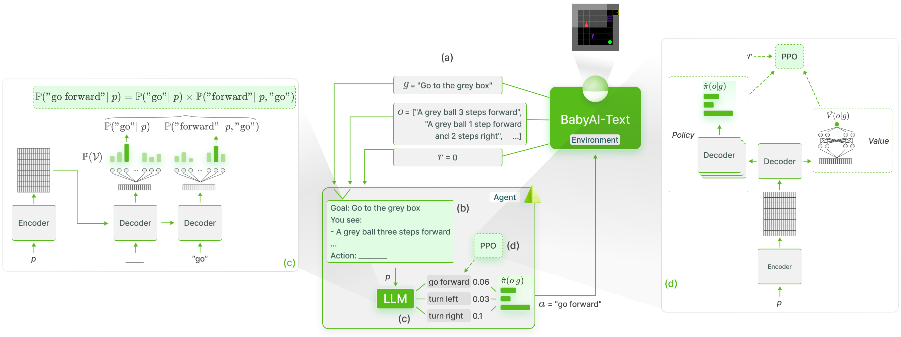

# Grounding Large Language Models with Online Reinforcement Learning

This repository contains the code used for our paper [Grounding Large Language Models with Online Reinforcement Learning](https://arxiv.org/abs/2302.02662).
We perform functional grounding of LLMs' knowledge in BabyAI-Text: 


We then perform an in-depth anaylsis of the generalization abilities of our trained agents:


We release our [BabyAI-Text environment](babyai-text) along with the code to perform our experiments (both training agents and evaluating their performance).
We rely on the [Lamorel](https://github.com/flowersteam/lamorel) library to use LLMs.

Our repository is structured as follows:

📦 Grounding_LLMs_with_online_RL  
┣ 📂 [`babyai-text`](babyai-text) -- *our BabyAI-Text environment*       
┣ 📂 [`experiments`](experiments) -- *code for our experiments*    
┃ ┣ 📂 [`agents`](experiments/agents) -- *implementation of all our agents*  
┃ ┃ ┣ 📂 [`bot`](experiments/agents/bot)  -- *bot agent leveraging BabyAI's bot*  
┃ ┃ ┣ 📂 [`random_agent`](experiments/agents/random_agent)  -- *agent playing uniformly random*  
┃ ┃ ┣ 📂 [`drrn`](experiments/agents/drrn)  -- *DRRN agent from [here](https://github.com/microsoft/tdqn)*  
┃ ┃ ┣ 📂 [`ppo`](experiments/agents/ppo)  -- *agents using PPO*  
┃ ┃ ┃ ┣ 📜 [`symbolic_ppo_agent.py`](experiments/agents/ppo/symbolic_ppo_agent.py)  -- *SymbolicPPO adapted from BabyAI's PPO*  
┃ ┃ ┃ ┗ 📜 [`llm_ppo_agent.py`](experiments/agents/ppo/llm_ppo_agent.py)  -- *our LLM agent grounded using PPO*  
┃ ┣ 📂 [`configs`](experiments/configs)  -- *Lamorel configs for our experiments*  
┃ ┣ 📂 [`slurm`](experiments/slurm) -- *utils scripts to launch our experiments on a SLURM cluster*  
┃ ┣ 📂 [`campaign`](experiments/campaign) -- *SLURM scripts used to launch our experiments*  
┃ ┣ 📜 [`train_language_agent.py`](experiments/train_language_agent.py) -- *train agents using BabyAI-Text (LLMs and DRRN) -> contains our implementation of PPO loss for LLMs as well as additional heads on top of LLMs*  
┃ ┣ 📜 [`train_symbolic_ppo.py`](experiments/train_symbolic_ppo.py) -- *train SymbolicPPO on BabyAI (with BabyAI-Text's tasks)*  
┃ ┣ 📜 [`post-training_tests.py`](experiments/post-training_tests.py) -- *generalization tests of trained agents*  
┃ ┣ 📜 [`test_results.py`](experiments/test_results.py) -- *utils to format results*  
┃ ┗ 📜 [`clm_behavioral-cloning.py`](experiments/clm_behavioral-cloning.py) -- *code to perform Behavioral Cloning on an LLM using trajectories*

## Installation steps
1. **Create conda env**
```
conda create -n dlp python=3.10.8; conda activate dlp
```
2. **Install PyTorch**
```
conda install pytorch==1.12.1 torchvision==0.13.1 torchaudio==0.12.1 cudatoolkit=11.3 -c pytorch
```
3. **Install packages required by our package**
```
pip install -r requirements.txt
```
4. **Install BabyAI-Text**: See installation details in the [`babyai-text`](babyai-text) package
6. **Install Accelerate**
```
cd v0.13.2/accelerate-0.13.2; pip install -e .; cd ../..
```
7. **Install Lamorel**
```
git clone https://github.com/ClementRomac/lamorel.git; cd lamorel/lamorel; pip install -e .; cd ../..
```

## Launch
Please use Lamorel along with our [configs](experiments/configs).
You can find examples of our training scripts in [campaign](experiments/campaign).

### Training a Language Model
To train a Language Model on a BabyAI-Text environment, one must use the [`train_language_agent.py`](experiments/train_language_agent.py) file.
This script (launched with Lamorel) uses the following config entries:
```yaml
rl_script_args:
  seed: 1
  number_envs: 2 # Number of parallel envs to launch (steps will be synchronized, i.e. a step call will return number_envs observations)
  num_steps: 1000 # Total number of training steps
  max_episode_steps: 3 # Maximum number of steps in a single episode
  frames_per_proc: 40 # The number of collected transitions to perform a PPO update will be frames_per_proc*number_envs
  discount: 0.99 # Discount factor used in PPO
  lr: 1e-6 # Learning rate used to finetune the LLM
  beta1: 0.9 # PPO's hyperparameter
  beta2: 0.999 # PPO's hyperparameter
  gae_lambda: 0.99 # PPO's hyperparameter
  entropy_coef: 0.01 # PPO's hyperparameter
  value_loss_coef: 0.5 # PPO's hyperparameter
  max_grad_norm: 0.5 # Maximum grad norm when updating the LLM's parameters
  adam_eps: 1e-5 # Adam's hyperparameter
  clip_eps: 0.2 # Epsilon used in PPO's losses clipping
  epochs: 4 # Number of PPO epochs performed on each set of collected trajectories
  batch_size: 16 # Minibatch size
  action_space: ["turn_left","turn_right","go_forward","pick_up","drop","toggle"] # Possible actions for the agent
  saving_path_logs: ??? # Where to store logs
  name_experiment: 'llm_mtrl' # Useful for logging
  name_model: 'T5small' # Useful for logging
  saving_path_model: ??? # Where to store the finetuned model
  name_environment: 'BabyAI-MixedTestLocal-v0' # BabiAI-Text's environment 
  load_embedding: true # Whether trained embedding layers should be loaded (useful when lm_args.pretrained=False). Setting both this and use_action_heads to True (lm_args.pretrained=False) creates our NPAE agent.
  use_action_heads: false # Whether action heads should be used instead of scoring. Setting both this and use_action_heads to True (lm_args.pretrained=False) creates our NPAE agent.
  template_test: 1 # Which prompt template to use to log evolution of action's probability (Section C of our paper). Choices or [1, 2].
  nbr_obs: 3 # Number of past observation used in the prompt
```

For the config entries related to the Language Model itself, please see [Lamorel](https://github.com/flowersteam/lamorel).

### Evaluating performances on test episodes
To evaluate the performance of an agent (e.g. a trained LLM, BabyAI's bot...) on test tasks, use [`post-training_tests.py`](experiments/post-training_tests.py) and set the following config entries:
```yaml
rl_script_args:
  seed: 1
  number_envs: 2 # Number of parallel envs to launch (steps will be synchronized, i.e. a step call will return number_envs observations)
  max_episode_steps: 3 # Maximum number of steps in a single episode
  action_space: ["turn_left","turn_right","go_forward","pick_up","drop","toggle"] # Possible actions for the agent
  saving_path_logs: ??? # Where to store logs
  name_experiment: 'llm_mtrl' # Useful for logging
  name_model: 'T5small' # Useful for logging
  saving_path_model: ??? # Where to store the finetuned model
  name_environment: 'BabyAI-MixedTestLocal-v0' # BabiAI-Text's environment 
  load_embedding: true # Whether trained embedding layers should be loaded (useful when lm_args.pretrained=False). Setting both this and use_action_heads to True (lm_args.pretrained=False) creates our NPAE agent.
  use_action_heads: false # Whether action heads should be used instead of scoring. Setting both this and use_action_heads to True (lm_args.pretrained=False) creates our NPAE agent.
  nbr_obs: 3 # Number of past observation used in the prompt
  number_episodes: 10 # Number of test episodes
  language: 'english' # Useful to perform the French experiment (Section H4)
  zero_shot: true # Whether the zero-shot LLM (i.e. without finetuning should be used)
  modified_action_space: false # Whether a modified action space (e.g. different from the one seen during training) should be used
  new_action_space: #["rotate_left","rotate_right","move_ahead","take","release","switch"] # Modified action space
  im_learning: false # Whether a LLM produced with Behavioral Cloning should be used
  im_path: "" # Path to the LLM learned with Behavioral Cloning
  bot: false # Whether the BabyAI's bot agent should be used
```